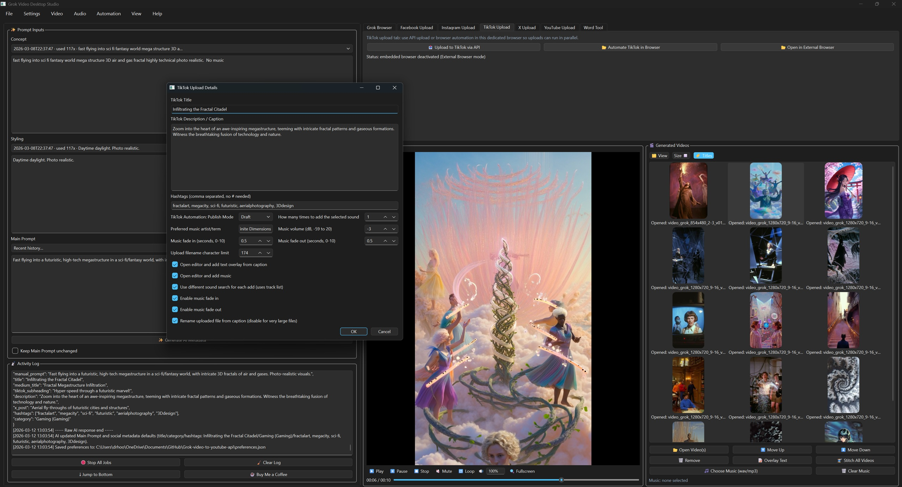
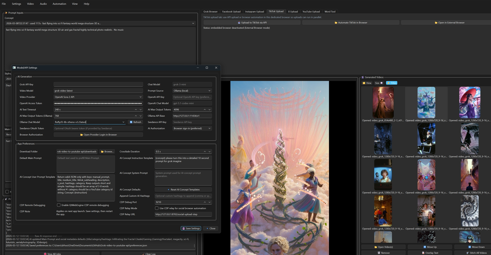

# Grok Video Studio - User Guide

This guide walks through the full setup, generation, editing, and publishing flow for Grok Video Studio. If you want the lightweight version first, start with the GitHub Pages guide at `docs/index.html`, then come back here for the full checklist and troubleshooting notes.

## 1. Install and launch

1. Install Python 3.11+ (native OS Python is fine, including 3.14).
2. Install `ffmpeg` and make sure it is available in your PATH.
3. Create a virtual environment and install dependencies:
   - `python -m venv .venv` (Linux/macOS) or `py -m venv .venv` (Windows)
   - `source .venv/bin/activate` (Linux/macOS) or `.\.venv\Scripts\Activate.ps1` (Windows)
   - `python -m pip install -r requirements.txt`
4. Launch the app with `python app.py`.
5. Optional: if you plan to use CDP automation, install Playwright Chromium with `python -m playwright install chromium`.

## 2. Configure credentials and models

Open **Model/API Settings** and configure the services you plan to use:

- `GROK_API_KEY`
- `OPENAI_API_KEY` and/or `OPENAI_ACCESS_TOKEN`
- `OLLAMA_API_BASE` and `OLLAMA_CHAT_MODEL` (optional)
- `SEEDANCE_API_KEY`
- Social upload credentials for YouTube, TikTok, Facebook, and Instagram



The main workspace is where you set prompt and provider choices, confirm settings, and access the upload tabs you will use later in the workflow.

## 3. Generate videos

1. Enter your concept, prompt, and duration controls in the left panel.
2. Select a prompt generation source:
   - Grok API
   - OpenAI API
   - Ollama local model
3. Select a video provider:
   - Grok Imagine API
   - OpenAI Sora 2 API
   - Seedance 2.0 API
4. Start generation and produce one or more variants.

## 4. Review, stitch, and export

1. Use **Generated Videos** to preview clips.
2. Select the clips you want to stitch.
3. Enable optional pipeline features as needed:
   - Crossfade transitions
   - 48 or 60 fps interpolation
   - Upscale (2x, 1080p, 1440p, or 4K)
   - GPU encode
   - Music mix
4. Export the final composition once you are happy with the result.



This workflow view is where you review clips, prepare final exports, and move into the platform-specific publishing tabs.

## 5. Publish to social platforms

Each upload tab supports both API and browser automation paths.

### YouTube

1. Select the source video.
2. Open the **YouTube Upload** tab.
3. Choose **Upload via API** or **Automate in Browser**.
4. For browser automation, provide:
   - title
   - description and hashtags
   - category
   - visibility (public, unlisted, or private)
   - audience
   - optional schedule datetime

### TikTok, Facebook, and Instagram

1. Select the source video.
2. Open the platform tab.
3. Upload by API or run browser automation.

## 6. Automation Chrome + CDP + UDP mode

1. Click **Start Automation Chrome**.
2. Click **Connect CDP**.
3. Optionally switch to **UDP** mode in the Automation panel for workflow-executor-based posting.
4. Run platform actions and monitor the Activity Log.

Use this mode when you want the desktop app to drive a real Chrome session for more resilient browser workflows.

## 7. Troubleshooting

- If stitching fails, verify the `ffmpeg` installation and PATH.
- If API uploads fail, refresh credentials and tokens.
- If browser automation steps fail, platform UI selectors may have changed.
- Use the Activity Log for diagnostics and execution traces.
- If YouTube browser automation pauses near the end, confirm the final publish step in the active Studio tab.

## Workflow screenshots and PDF (local generation)

To avoid committing large generated binaries, create the extended manual assets locally:

```bash
python docs/generate_user_manual.py
```

This produces:

- `docs/out/Grok-Video-Studio-User-Manual.pdf`
- `docs/out/assets/step-1-dashboard.png`
- `docs/out/assets/step-2-settings.png`
- `docs/out/assets/step-3-stitching.png`
- `docs/out/assets/step-4-upload.png`

Use these files for release attachments or offline distribution when you need a printable manual.
